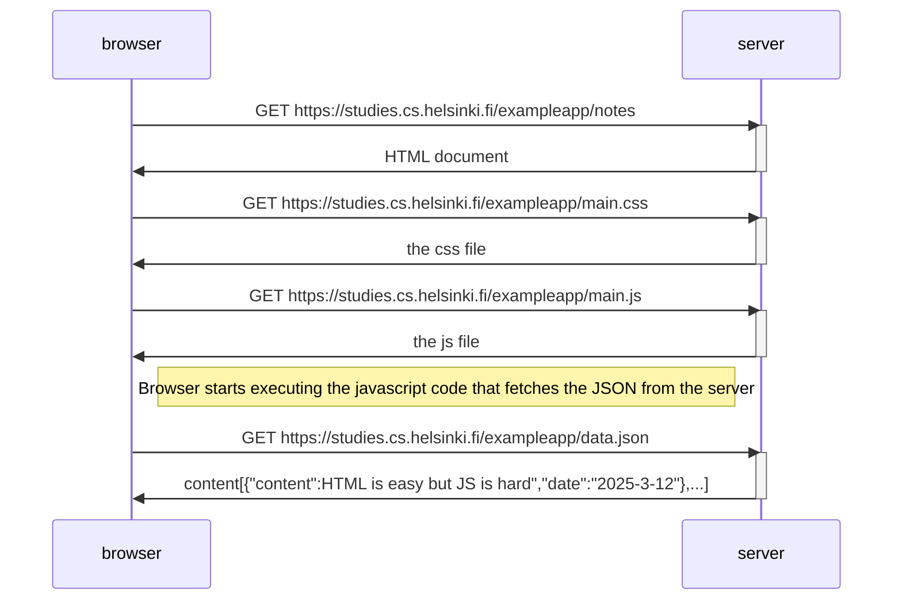

# Part-0.4,0.5,0.6-Sequence-Diagram

```mermaid
sequenceDiagram
  participant User
  participant browser
  participant server

  User->>browser:GET https://studies.cs.helsinki.fi/exampleapp/spa
  browser->>server: GET https://studies.cs.helsinki.fi/exampleapp/spa
  activate server
  server->>browser :https://studies.cs.helsinki.fi/exampleapp/spa
  browser->>User:https://studies.cs.helsinki.fi/exampleapp/spa
  deactivate server


